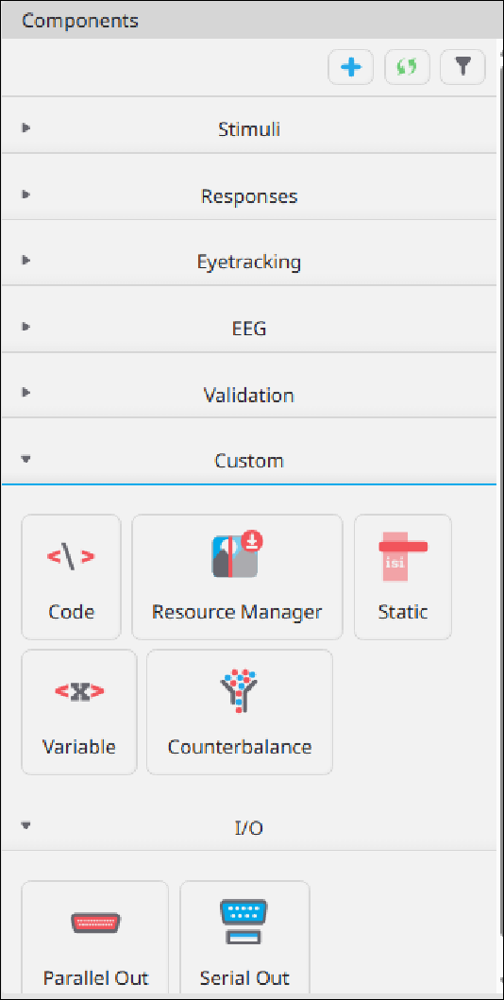
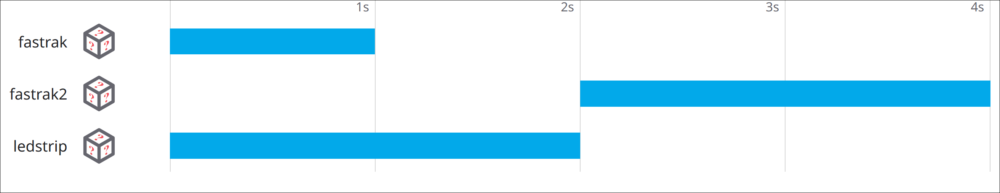

As described in the [data dictionary](../dd) components are the core functional piece of a PsychoPy
experiment, handling all [stimulus][DD_STMCOMP] and [response][DD_RSPCOMP] functionality. In this
development note we outline where some dragons live (in the "hic sunt dracones" sense) when working
with PsychoPy components. We break these into two categories one each for pre- and post- generation
components.  

## Pre-Generation

Pre-generation components are those found in the [PsychoPy Configurator][DD_CFG] and
represent/contain metadata for components before they are generated into an experiment.

/// caption
{#fig1-cfgcomp}
Figure 1: List of components available in the configurator  
///

/// caption
{#fig2-order}
Figure 2: The component configuration of a PsychoPy routine. Each represents a specific instance of
a component object. Each instance contains individually specific metadata. 
///

### Component Generator Object Instance Lifespan

Instances of component objects in the configurator begin life at one of two times. The earliest is
when the experiment configuration file is loaded. At load time an instance of each object in each
routine is created in memory. The second time an object can be created is when a component is added

## Post-Generation
